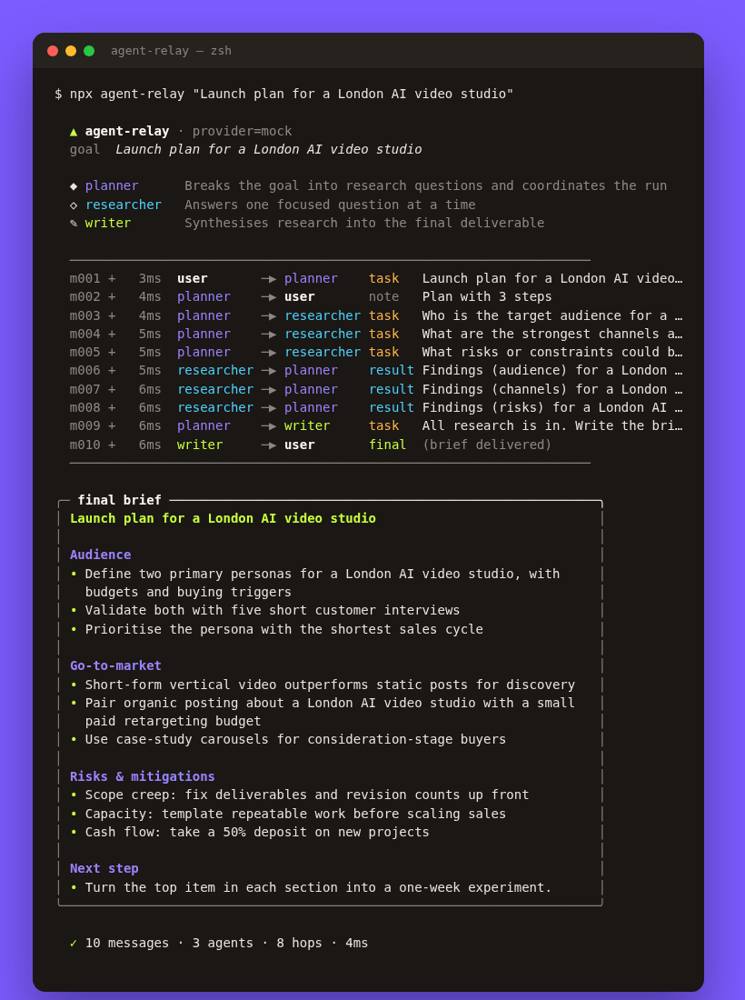

<div align="center">

# 🛰️ agent-relay

**A lightweight multi-agent orchestration demo in TypeScript: planner, researcher and writer agents relaying typed messages over a bus.**

[](https://github.com/hbtabi/agent-relay/actions/workflows/ci.yml)


[](LICENSE)

</div>

Most "agent frameworks" hide the interesting part. **agent-relay** is small enough to read in one sitting: agents
are classes, messages are plain objects, and a relay routes them until a final answer reaches the user. Every
message lands on a bus, so a run is fully traceable and replayable.

It works **offline out of the box** with a deterministic mock LLM, and switches to any **OpenAI-compatible API**
with `--provider openai`.

## 📸 Demo

<p align="center"></p>

Sample output: [`examples/launch-plan.md`](examples/launch-plan.md)

## ✨ Features

- **Three cooperating agents**
  - `planner`: breaks the goal into research questions (JSON plan, with a tolerant parser), fans out tasks, waits for every reply
  - `researcher`: answers one focused question per message
  - `writer`: synthesises the notes into a Markdown brief
- **Typed message bus**: ordered log, subscriptions, filtered history, `replyTo` threading
- **Pluggable LLM providers**: a `LLMProvider` interface with `MockProvider` (deterministic, offline) and `OpenAICompatibleProvider` (native `fetch`)
- **Safety rails**: hop limit against agent ping-pong loops, duplicate-name checks, errors for unknown recipients
- **Nice CLI**: colour-coded live timeline, boxed Markdown output, `--json` trace export, `--quiet` for piping, `--out` to save
- **Zero runtime dependencies**, tested with the built-in `node:test` runner

## 🚀 Quick start

```bash
git clone https://github.com/hbtabi/agent-relay.git
cd agent-relay
npm install
npm run demo                                   # build + run the sample goal
node dist/src/cli.js "Grow a Shoreditch barbershop" -o brief.md
node dist/src/cli.js "Plan a product launch" --json > trace.json
npm test                                       # 8 tests via node:test
```

### With a real model

```bash
export OPENAI_API_KEY=sk-...
export OPENAI_BASE_URL=https://api.openai.com/v1   # OpenRouter, Groq, Ollama... also work
export AGENT_RELAY_MODEL=gpt-4o-mini
node dist/src/cli.js "Launch plan for a London AI video studio" --provider openai
```

## 🧠 How it works

```
user ──task──▶ planner ──task×N──▶ researcher
                  ▲                    │
                  └─────result×N───────┘
                  │
                  └──task(notes)──▶ writer ──final──▶ user
```

```ts
import { Relay, PlannerAgent, ResearcherAgent, WriterAgent, MockProvider } from "agent-relay";

const llm = new MockProvider();
const relay = new Relay({ maxHops: 50 }).register(new PlannerAgent(llm), new ResearcherAgent(llm), new WriterAgent(llm));

relay.bus.subscribe((m) => console.log(`${m.from} → ${m.to}: ${m.kind}`));
const { output, messages } = await relay.run("Grow a Shoreditch barbershop");
```

### Add your own agent

```ts
class CriticAgent extends Agent {
  readonly name = "critic";
  readonly role = "Reviews drafts before they ship";
  async handle(msg: Message, ctx: AgentContext) {
    const review = await this.llm.complete({ system: "[role:critic] Be blunt.", prompt: msg.content });
    return [createMessage({ from: this.name, to: msg.from, kind: "result", content: review, replyTo: msg.id })];
  }
}
```

## 🗂️ Project structure

```
agent-relay/
├── src/
│   ├── core/          # message.ts, bus.ts, agent.ts (abstract base)
│   ├── agents/        # planner.ts, researcher.ts, writer.ts
│   ├── providers/     # types.ts, mock.ts, openai.ts, index.ts (factory)
│   ├── cli/format.ts  # ANSI colours, boxes, wrapping
│   ├── relay.ts       # the router / orchestrator
│   ├── index.ts       # public API
│   └── cli.ts         # `agent-relay` command
├── test/              # node:test suites
├── examples/          # sample output
└── docs/demo.png
```

## 🛣️ Roadmap

- [ ] Parallel dispatch of independent tasks (`Promise.all` per fan-out)
- [ ] Critic agent + revision loop with a max-iterations budget
- [ ] Tool calling (web search, file read) for the researcher
- [ ] Token and cost accounting per agent
- [ ] Trace viewer (static HTML from `--json` output)

## 📄 License

[MIT](LICENSE) © 2026 Mohammed Hassan bin Tayyeb · Built by [Hasenix](https://github.com/hbtabi)
